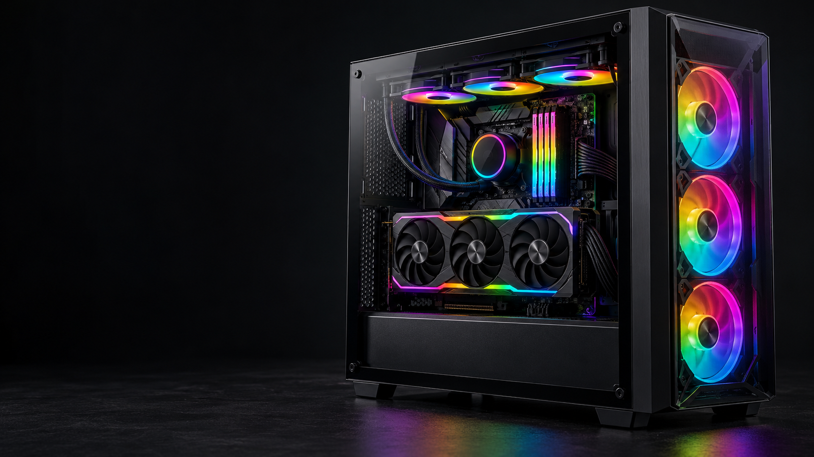

# PRIME IT: запись на визит, UI/UX и реалистичная сборка ПК

Дата: 7 октября 2026.

Актуальный бриф следующего ролика: [корпус-аквариум, дисплей СЖО и финальное приближение к PRIME IT](./aquarium-pc-video-prompt-2026-10-07.md). Старое видео по кнопке удалено. Ниже сохранён исходный аудит и предыдущий общий сценарий.

## Что изменено в сайте

Владелец подтвердил, что PRIME IT работает с выездом: мастер может отсутствовать по адресу. Посещение сервиса нужно заранее согласовать по телефону.

- На первом экране перед кнопками связи, на всех десяти страницах услуг, в контактах и футере указано: «Приём по предварительному звонку. Мастер может быть на выезде».
- Контакты начинаются с предупреждения и кнопки «Позвонить перед визитом». Адрес, рабочие часы, WhatsApp и маршрут сохранены. Условия выезда согласуются по телефону; бесплатный выезд и выдуманная стоимость не обещаются.
- Новые условия отражены в WhatsApp-сообщениях, отображаемом FAQ, FAQPage, LocalBusiness.description, уникальных description всех страниц и OG-изображении.
- На главной убран второй длинный сценарий прокрутки. Процесс ремонта показывается тремя компактными шагами. Услуги, цены и отзывы теперь находятся перед ним; лицензии перемещены после контактов.
- Расстояние прокрутки сборки ПК сокращено. Ссылка «Выбрать мою проблему» сразу переходит к симптомам.
- В демонстрационном компьютере добавлены многоцветные RGB-кольца вентиляторов и подсветка памяти, помпы и видеокарты: красный, янтарный, зелёный, голубой, синий, фиолетовый и розовый.

Рабочие часы 10:00–20:00 ежедневно означают время работы сервиса, а не обещание постоянного присутствия мастера по адресу.

## Результат UI/UX-аудита

| Проблема | Решение и причина |
| --- | --- |
| Две длинные анимированные истории задерживали переход к цене и отзывам | Оставлена одна короткая сборка; процесс ремонта стал компактным |
| Адрес и маршрут создавали ожидание свободного посещения | Предупреждение о звонке видно до CTA; в контактах телефон стоит первым |
| Выездная работа не была описана | Выезд назван прямо в hero, шапке, контактах и FAQ; условия обсуждаются заранее |
| Лицензии отвлекали от основной задачи ремонта | Дополнительный раздел находится после контактов, прежние ссылки работают |
| Зелёная/голубая подсветка не выглядела как RGB | В одной сцене используется полный цветовой спектр |
| SVG выглядел как плоская схема | Ограничение признано; ниже подготовлен конкретный сценарий цельного 3D-рендера |

Порядок главной: **первый экран → преимущества → проблема устройства → услуги → цены → отзывы → три шага ремонта → FAQ → контакты и запись → дополнительные лицензии**.

Сборка игрового компьютера остаётся декоративной демонстрацией. Текст о ремонте, бесплатная диагностика и обращение должны сохранять главный визуальный приоритет. Нельзя превращать первую часть страницы в обязательный просмотр рекламного фильма.

Нижняя панель WhatsApp/звонка, доступные контекстные сообщения, обычная прокрутка, глубокие ссылки, работа без JavaScript и reduced motion сохранены.

## Что ещё нужно для реалистичного визуала

Текущая сборка — SVG-иллюстрация; она не заменена фотореалистичным роликом. Готового видео/3D-рендера в этом обновлении нет.

Подготовлен отдельный [сгенерированный RGB-референс финального кадра](../assets/references/gaming-pc-rgb-final.png). Это ориентир для будущего визуала, а не фотография реальной работы PRIME IT. Он не подключён к странице и не увеличивает её загрузку.



Для устойчивого реализма рекомендован **Blender → цельный рендер сборки → оптимизированная последовательность кадров для прокрутки**. Корпус, комплектующие, стекло, отражения и RGB должны рендериться вместе из одной сцены. Это позволяет сохранить размеры деталей и настоящие перекрытия: эффект не строится из отдельных фотографий поверх друг друга.

Для быстрого видеопрототипа можно использовать Veo 3.1 с управлением первым/последним кадром или Runway Gen-4.5 с image-to-video. Это варианты подготовки исходного материала. Генеративный ролик обязательно проверяется: форма корпуса, число вентиляторов, геометрия видеокарты, кабели и отражения не должны меняться между кадрами. Промпт не гарантирует механически правильную сборку.

В этой сессии нет подключённого инструмента видеогенерации. Платные генерации, подписки и рендер на стороннем аккаунте не запускались.

Проверенные официальные источники:

- [Blender: рендер анимации и последовательности кадров](https://docs.blender.org/manual/en/latest/render/output/animation.html).
- [Veo 3.1: первый/последний кадр и референсы](https://ai.google.dev/gemini-api/docs/veo?hl=en).
- [Runway Gen-4.5: text-to-video и image-to-video](https://help.runwayml.com/hc/en-us/articles/46974685288467-Creating-with-Gen-4-5).
- [HTML media: перемотка видео](https://html.spec.whatwg.org/multipage/media.html#seeking).
- [MDN: fastSeek использует приблизительную позицию](https://developer.mozilla.org/en-US/docs/Web/API/HTMLMediaElement/fastSeek).
- [WebKit: воспроизведение видео на iOS](https://webkit.org/blog/6784/new-video-policies-for-ios/).

Обычный MP4 тоже можно связать с прокруткой. Однако перемотка асинхронна, зависит от кодека, ключевых кадров и устройства; точность и плавность нужно проверять на физическом iPhone. Утверждение, что Safari не поддерживает такой подход, было бы неверным.

## Сценарий для 3D-художника

Один матовый чёрный корпус со стеклянной боковой панелью, крупной видеокартой с тремя вентиляторами, ATX-платой, четырьмя модулями памяти, SSD, блоком питания и жидкостным охлаждением. Комплектующие без заявленных торговых марок, мощности, FPS или цены.

Камера неподвижна: три четверти, видны стеклянная сторона и передняя панель. На desktop компьютер занимает правые 55% кадра, слева — спокойный тёмный фон под текст. Для mobile нужна отдельная композиция с компьютером по центру; нельзя просто обрезать широкий кадр.

| Прогресс | Действие |
| --- | --- |
| 0–15% | Корпус уже стоит на поверхности; устанавливается плата с процессором |
| 15–35% | Память занимает слоты, появляется SSD |
| 35–55% | Видеокарта входит в разъём по короткой правильной траектории |
| 55–75% | Завершается установка охлаждения и блока питания |
| 75–88% | Подключаются кабели, закрывается стеклянная панель |
| 88–100% | Включается согласованная RGB-подсветка и появляется свет на поверхности |

Компоненты — твёрдые объекты. Они не растворяются, не изменяют форму, не пересекают корпус и не летают вокруг. RGB даёт умеренные отражения на стекле и металле, без ослепляющего bloom. Финальный кадр стабилен и подходит для poster.

## Готовый промпт для видеопрототипа

Для text-to-video использовать описание полностью. Для image-to-video загрузить согласованный референс того же корпуса, затем оставить в промпте прежде всего движение, камеру и последовательность. Контроль первого/последнего кадра выбирать только в режиме, который действительно его поддерживает.

```text
Create an 8-second photorealistic premium product assembly visualization of a powerful gaming desktop computer for a professional computer repair website.

Use one continuous shot with a completely locked camera, a fixed three-quarter view showing both the tempered-glass side and the front panel, consistent focal length, exposure, composition and lighting throughout. Place the complete tower within the right 55% of a 16:9 frame. Keep the left 45% as clean, nearly black negative space for website text.

The subject is a realistic matte-black mid-tower case with brushed metal, a transparent tempered-glass side panel, an ATX motherboard, a substantial triple-fan graphics card, four RAM modules, an SSD, a power supply and liquid cooling. Use generic unbranded hardware with clean unlettered surfaces. All parts preserve their shapes, dimensions and textures throughout the shot.

Start with the empty chassis firmly resting on a dark studio surface. Show a precise product assembly sequence: the motherboard and processor assembly seats against its mounting points; RAM and the SSD settle into their sockets; the graphics card slides along a short correctly aligned path into its slot; cooling and the power supply settle into their mounting locations; cables connect and the glass side panel closes. Parts move as rigid solid objects with realistic clearance and occlusion.

In the final part of the shot, the completed PC powers on. The front fans, cooling fans and RAM illuminate with tasteful synchronized RGB: cyan, violet, magenta, red, amber and green, with smooth colour transitions. Show physically plausible coloured reflections on metal and glass, restrained bloom and subtle light on the surface underneath. Fan rotation begins only after assembly is complete.

Use premium studio product photography, physically based materials, believable thickness, sharp hardware detail, soft directional lighting, realistic shadows and glass reflections. End on a stable, fully assembled beauty frame. If reference frames are supplied, preserve the same hardware and camera framing. Silent visual output; clean hardware and background without typography.
```

Если платформа поддерживает отдельное negative prompt, можно добавить:

```text
Cuts, camera movement, zoom, morphing, dissolving components, duplicated hardware, changing fan count, weightless orbiting, impossible collisions, disconnected floating cables, exaggerated neon bloom, people, hands, labels, logos, subtitles, specifications, HUD overlays.
```

Для mobile заменить композицию на 9:16, компьютер по центру с отступами от верхнего и нижнего края. Геометрия и ракурс остаются теми же.

## План подключения готового материала

Это требования следующего этапа, а не уже установленный проигрыватель.

1. Согласовать финальный RGB-кадр и тот же пустой корпус; затем подготовить цельную сборку.
2. Проверить рендер на изменения геометрии, пересечения и неверное размещение деталей.
3. Подготовить лёгкий WebP-poster и desktop/mobile-последовательности. Первоначальный ориентир — 72–96 desktop-кадров и 36–48 mobile-кадров; количество определяется плавностью и весом результата.
4. Целевой сетевой бюджет: примерно 3–5 МБ desktop и 1–2 МБ mobile; это цель оптимизации, а не обещание без измерения готового рендера.
5. Загружать кадры постепенно при приближении сцены. Ограничить декодированный кэш соседними кадрами, а не держать всю анимацию в памяти: 96 кадров 960×540 RGBA занимают около 199 МБ до дополнительных накладных расходов.
6. Связать номер кадра с существующим прогрессом прокрутки. Обратное движение показывает те же кадры в обратном порядке, без таймера и перехвата жестов.
7. При reduced motion, Save-Data, ошибке загрузки или отсутствии JavaScript оставить полный RGB-poster, текст, телефон и WhatsApp.
8. Оставить H1, контакты и сведения об услугах в статическом HTML. Анимация не должна задерживать LCP и закрывать CTA.
9. Проверить Chrome, WebKit и физический iPhone; сравнить плавность, память, сетевой вес и доступность кнопок.

## Проверка этого обновления

[Production QA](https://github.com/winproga-dot/prime-it/actions/runs/37591837588) прошёл на коммите `2c7c1121ef3624867f1d21c10b1b876caa70b694`.

- `npm install`, `npm run build` и проверка статического HTML всех 11 страниц завершены успешно; `npm audit`: 0 уязвимостей.
- 14 сценариев прокрутки: непрерывные движения, обратный ход, остановка, установка десяти групп деталей, RGB, закрепление и доступность контактов.
- 8 сценариев порядка блоков и компактного процесса: предупреждение о звонке видно до прокрутки и до кнопок связи, телефон первым в контактах, выбранный симптом сохраняется, три шага доступны без JavaScript.
- 172 общих сценария Chromium/WebKit: главная и десять страниц услуг на семи размерах экрана, увеличение текста до 200%, меню landscape, WhatsApp/tel/2GIS, deep links, видео с повтором и отменой загрузки.
- Размеры: 360×800, 390×844, 412×915, 430×932, 1366×768, 1920×1080, 2560×1440. axe: 0 нарушений в проверенных сценариях.
- Lighthouse главной: Performance 99, Accessibility 100, Best Practices 100, SEO 100; LCP 2,0 с, CLS 0,004, TBT 0 мс.
- Lighthouse страницы чистки: 99 / 100 / 100 / 100; LCP 1,8 с, CLS 0, TBT 0 мс.
- JS 260,36 КБ / gzip 78,19 КБ; CSS 61,16 КБ / gzip 12,67 КБ.
- Визуально проверены свежие кадры hero desktop/mobile, RGB, контактов и компактного процесса. Сохранены кадры этапов и запись обратимой прокрутки.

[Артефакт production-проверки](https://github.com/winproga-dot/prime-it/actions/runs/37591837588/artifacts/11469585758) содержит build, отчёты, screenshots и запись.

Это лабораторные проверки Chromium и WebKit, не тест каждого физического телефона и не полевой INP. Реалистичный видеоролик ещё не создан и потому не тестировался. Новый PNG-референс хранится только в `assets/references`, не используется build-скриптом и не загружается посетителями.

[Предпросмотр](https://prime-it-git-prime-it-redesign-2026-winproga-dots-projects.vercel.app/) обновлён; Vercel подтвердил успешное развёртывание проверенного кода.

## Что синхронизировать вне сайта

В Google Business Profile и 2GIS указать фактические часы, выездную работу и приём по предварительному звонку. После публикации проверить данные через Google Search Console и актуальный sitemap. Позиции поиска не гарантируются.
